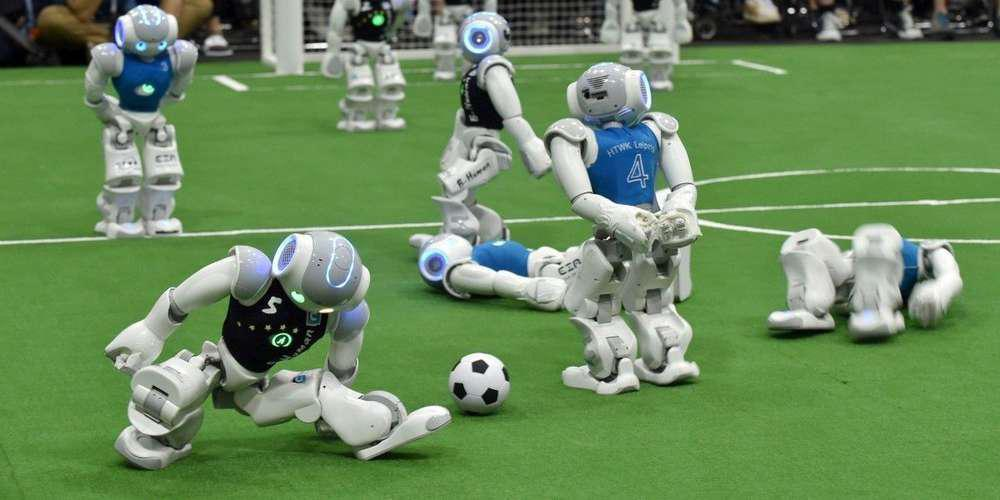

# MGL7320 - Ingénierie logicielle des systèmes d'IA

## Cours  basé sur [SE4AI Training Program](https://github.com/create-se4ai/engineering-ai-systems-course) :


>This course is part of the [SE4AI Training Program](https://www.se4ai.org/), a training program on the development, deployment and servicing of Artificial Intelligence-based Software Systems. The program was established in collaboration world-renowned researchers and technology leaders and is composed of four Canadian universities: Concordia University, Polytechnique Montréal, Queens University, and the University of Alberta.  
>
>This particular version of the course was given as a special course at [UQAM](www.uqam.ca) in the Winter of 2023, under the slot course MGL7811 - Sujets spéciaux en génie logiciel II.
Hence, the description below - in French - is specific to this version of the course.
Alongside the language differences, there are other specific changes to the original material:
1. The course was structured to be given in 15 weeks, instead of 13 weeks. Hence, a few new modules were added.
2. The course was structured as a practical course, instead of research oriented. Students have to develop a project, which is presented at the end of the course. The project is developed in groups of 3-4 students and has a practical component (i.e., developing a software system) and a research component (i.e., writing a report and presenting the results). More details about this can be found in the [course-project](./course-project) folder.
1. The original set of papers were also updated as well as the slides style and content.


## Travail en cours !!!

- :new: Disponible sur [https://github.com/lomagnin/MGL7320-automne-2023](https://github.com/lomagnin/MGL7320-automne-2023)

# Description du cours

Ce cours vise à fournir les concepts et pratiques clés liés à l'ingénierie des systèmes d’intelligence artificielle (<i>MLOPs</i>). Les sujets inclus sont la spécification et l’architecture des systèmes d’intelligence artificielle, la validation et la gestion des données, le processus de sélection des modèles, les tests ainsi que le déploiement des systèmes d'intelligence artificielle. Les sujets spéciaux sur l'interprétation, l’équité et les opérations des systèmes d’intelligence artificielle peuvent aussi être inclus.

Dans la mesure du possible seront proposés des travaux et exercices effectués au sein d'une plateforme <i>MLOPs</i> dédiée, hébergée gracieusement sur le <i>Cloud</i>.  

# Objectifs d'Apprentissage du Cours

L’objectif du cours est de fournir aux étudiants gradués les connaissances techniques de base et fondamentales tout en appliquant de façon concrète les concepts et processus de génie logiciel (GL) dans le contexte d’un système d’intelligence artificielle (IA). À la fin de ce cours, les étudiants seront capables d’identifier les enjeux liés aux systèmes d’intelligence artificielle et de proposer un ensemble de solutions pour spécifier, développer et maintenir les systèmes d’intelligence artificielle. Le cours se concentre sur l’interconnexion du GL et de l’IA, et sur la manière dont les sujets couverts s’appliquent aux systèmes basés sur l’IA.

<h2><p style="text-align: center;">
<br>
<a href="https://ml-ops.org/content/mlops-principles">MLOPs</a>  
</p></h2>

# Présentation du chargé de cours (Dr. Laurent Magnin)



- Doctorat en Intelligence Artificielle (1996)
  - Anciennement chercheur en IA
  - Chargé de cours / professeur associé
- Consultant:
  - Systèmes experts
  - Big Data
- Développeur / Architecte
- Travaille présentement pour une compagnie d'assurance
  - Architecte IA
  - Scientifique de données

# Contenu du cours

## Format des séances
- Les jeudis 18h00 à 21h00 (présentiel)  
- Salle [SH-3540 | Campus de Montréal](http://carte.uqam.ca/#pavillon/sh)  
- 10 minutes de pause (Disponible pour répondre aux questions)

Les séances:
- Inclurent des discussions actives
- Utilisation de [AhaSlides](https://ahaslides.com/)

## Classe d’Ingénierie


Concentré sur le jugement d’ingénierie
- « Trade-offs » et justifications plutôt qu’une seule bonne réponse
- Engagement pratique

Non axé sur:
- les garanties formelles ou
- les principes fondamentaux d’IA

<p style="text-align: center;"><b>Balance entre théorie :bulb: (pdf) & aspects pratiques :nut_and_bolt: </b></p>

:new: Tentative : :nut_and_bolt: projets sur des **environnements <i>Cloud</i>**.

## Ce qui est attendu de vous

- Assister à des conférences et participer à des discussions

- Faites les lectures et les devoirs assignés!

- Travaillez sur votre projet en continu.

- Apportez vos idées et vos préoccupations en classe

- **Posez des questions.**

## Calendrier

Le calendrier ci-dessous est susceptible d’évoluer.

| Semaine | Sujet | Date |
| ------- | ----- | ---- |
| 1		    | [Introduction et aperçu de l’intelligence artificielle (IA)](./lectures/01_introduction/01_introduction.md) - [Quizz](https://presenter.ahaslides.com/share/mgl7320-introduction-1694396648784-rphlf4xe68) | 7 septembre |
| 2	      |	[Apprentissage Automatique (ML)](./lectures/02_machine_learning/02_machine_learning.md) - [Quizz](https://presenter.ahaslides.com/share/mgl7320-apprentissage-automatique-1695260512690-pib46rmqhk) | 14 septembre |
| 3		    | [Exigences et spécifications des systèmes d'IA](./lectures/03_requirements/03_requirements.md) - [Quizz](https://presenter.ahaslides.com/share/mgl7320-exigences-et-specifications-1695867471343-vyelza98n5) | 21 septembre |
| 4       | [Architecture des systèmes d'intelligence artificielle](./lectures/04_architecture/04_architecture.md) - [Quizz](https://presenter.ahaslides.com/share/mgl7320-architecture-1696473432719-mhv4g5gjnt) | 28 septembre |
| 5	      |	[Validation et gestion des données](./lectures/05_data_validation/05_data_validation.md) - [Quizz](https://presenter.ahaslides.com/share/mgl7320-validation-et-gestion-des-donnees-1697130824322-7g1ablx8rw) | 5 octobre |
| 6	      | [Sélection des modèles](./lectures/06_model_selection/06_model_selection.md) - [Quizz](https://presenter.ahaslides.com/share/mgl7320-selection-des-modeles-1697670906548-7jwxh94glm) | 12 octobre |
| 7     	| ~~Mises à jour des projets (présentations faites par les étudiants)~~ | ~~19 octobre~~ |
| 7       | [Infrastructure(s), Outils et Plateformes](./lectures/07_infra_platforms/07_infra_platforms.md) | 19 octobre |
| 8     	| Présentation du plan du projet en équipe | 26 octobre |
| 9       | [Test des systèmes d'intelligence artificielle](./lectures/09_testing/09_testing.md) - [Quizz](https://presenter.ahaslides.com/share/mgl7320-tests-1699564632973-5w82moiprm) | 2 novembre |
| 10      | [Déploiement des systèmes d'intelligence artificielle](./lectures/10_deploying/10_deploying.md) | 9 novembre |
| 11      |	[Confiance dans la prédiction et l'explicabilité du modèle](lectures/11_explanation_trust/11_explanation_trust.md)<br>(+ remise Projet(s) personnel(s)) | 16 novembre |
| 12		  | _Cours annulé du fait de grève_ | 23 novembre |
| 13		  | [Sujets spéciaux: l'applicabilité de modèles des langages](./lectures/12_special_topic/12_special_topic.md) + évaluation de l’enseignement |
| 14      |	Examen (**en salle PK-S1525**) | 7 décembre |
| 15		  | Présentations par les étudiants de leur projets en équipe | 14 décembre |

# Évaluation

L'évaluation du cours est composé ainsi :

| Éléments d’évaluation			| %  | Date (de remise) |
| ------------------------- | -- | ---- |
| :couple: [Présentation du plan du projet en équipe](./projets/projets.md) |	10 | ~~19 octobre~~ 26 octobre |
| :walking: [Projet(s) personnel(s)](./projets/projets.md) | 40 | :new: 19 novembre  |
| :couple: Démonstration du projet en équipe |	10 | 14 décembre |
| :couple: Rapport final du projet en équipe |	20 | 14 décembre |
| :walking: Examen	| 20 | 7 décembre |

L’examen se fera en deux temps :
- sur papier, sans documents (1/3 temps, 1/3 note)
- sur ordinateur (2/3 temps, 2/3 note):
  - :new: **dans la salle de laboratoire du LAMISS, PK-S1525**
  - obligation d’avoir son laptop (avec accès à Internet) le jour de l’examen
  - la remise se fera avec Github Classroom
  - libre accès au cours et au Web (interdiction toutefois d’aide à distance)


Usage de [GitHub Classroom](https://classroom.github.com/classrooms/144286703-uqam-lomagnin-mgl7320-automne2023)


# Médiagraphie

Le cours [originel] fera occasionnellement référence au manuel suivant :
- Building Intelligent Systems: A Guide to Machine Learning Engineering, 2018. Geoff Hulten

Autres références :
- [The Big Book of MLOps](https://www.databricks.com/resources/ebook/the-big-book-of-mlops) (copie gratuite)

## Questions et communication

- Par courriel : magnin [dot] laurent_yves [at] uqam [dot] ca (Inclure [MLG7320] dans le titre du message)

- ~~Par clavardage (Teams)~~

- Planifiez une réunion en personne / Zoom si nécessaire.

- Poser des questions durant ou après la séance

- Discutez avec vos camarades de classe

## Want to use any of the course's materials?

> You are free to use and distribute the course's material as long as you:
- **Abide by the license**, please check the [LICENSE](LICENSING.md) conditions
- **Notify us** and let us know how you plan to use the material using the contact e-mails below. There is no vetting process in place, we just want to be notified to have control of who is using the material.
>
> You can cite this repository using the following BibText entry, if you plan to use this material in a scientific work:
```
@misc{SE4AI_course,
author = {Emad Shihab and Diego Elias Costa},
title = {SE4AI course: Engineering AI-Based Software Systems},
publisher = {Data-Driven Analysis of Software (DAS) Lab, Concordia University},
note = {https://github.com/create-se4ai/engineering-ai-systems-course}
}
```
