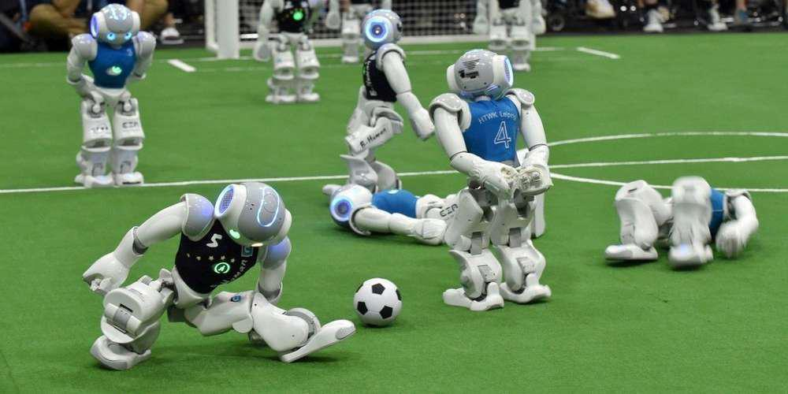
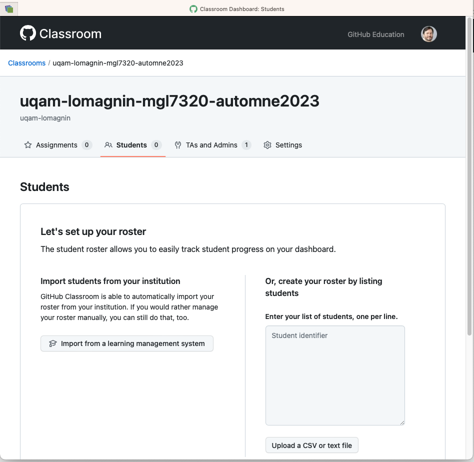

# MGL7320 - Ingénierie logicielle des systèmes d'IA

### :bulb: Ce contenu est disponible sur [https://uqam-lomagnin.github.io/MGL7320/](https://uqam-lomagnin.github.io/MGL7320/)

### :bulb: Cours originellement basé sur [SE4AI Training Program](https://github.com/create-se4ai/engineering-ai-systems-course)

## Description du cours

Ce cours vise à fournir les concepts clés liés à l'ingénierie des systèmes d'intelligence artificielle.

### Objectifs

L'objectif du cours est de fournir aux étudiants gradués les connaissances techniques de base et fondamentales tout en appliquant les concepts et processus de génie logiciel (GL) dans le contexte d'un système d'intelligence artificielle (IA). À la fin de ce cours, les étudiants seront capables d'identifier les enjeux liés aux systèmes d'intelligence artificielle et de proposer un ensemble de solutions pour spécifier, développer et maintenir les systèmes d'intelligence artificielle. Le cours se concentre sur l'interconnexion du GL et de l'IA, et sur la manière dont les sujets couverts s'appliquent aux systèmes basés sur l'IA.

<h2>

 
<a href="https://ml-ops.org/content/mlops-principles">MLOPs</a>  

</h2>

## Votre chargé de cours (Laurent Magnin, PhD)

- Doctorat en Intelligence Artificielle (1996)
  - Initialement chercheur en IA
  - Chargé de cours / professeur associé
- Consultant:
  - Systèmes experts
  - _Big Data_
- Développeur / Architecte
- Travaille présentement pour une compagnie d'assurance
  - Architecte IA
  - Scientifique de données

## Contenu du cours

### Format des séances
- Les mardis de 18h00 à 21h00 (présentiel)  
- Salle [SH-3560 - Campus de Montréal](http://carte.uqam.ca/#pavillon/sh)  
- 10 minutes de pause (Disponible pour répondre aux questions)
- Quizzes (par [AhaSlides](https://ahaslides.com/))

### Classe d’Ingénierie

Concentré sur le jugement d’ingénierie
- « Trade-offs » et justifications plutôt qu’une seule bonne réponse
- Engagement pratique

Non axé sur:
- les garanties formelles ou
- les principes fondamentaux d’IA

<b>Balance entre théorie :bulb: (pdf) & aspects pratiques :nut_and_bolt: </b>

### Calendrier

| Semaine | Sujet | Date |
| ------- | ----- | ---- |
| 1		    | [Introduction et aperçu de l’intelligence artificielle (IA)](./lectures/01_introduction/) | 3 septembre |
| 2	      |	[Apprentissage Automatique (ML)](./lectures/02_machine_learning/) | 10 septembre |
| 3		    | [Docker & autres outils] | 17 septembre |
| 4       | [Architecture des systèmes d'intelligence artificielle] | 24 septembre |
| 5	      |	[Validation et gestion des données] | 1 octobre |
| 6	      | [Sélection des modèles] | 8 octobre |
| 7     	| :walking: Remise projets personnels (avec démos faites par les étudiants) | 15 octobre |
| 8       | [IA générative] | 22 octobre |
| 9     	| [Systèmes multiagents] & [Systèmes experts]| 29 octobre |
| 10      | :couple: Présentation (non évaluée) du plan du projet en équipe | 5 novembre |
| 11      | [Infrastructure(s), Outils et Plateformes] | 12 novembre |
| 12      |	[Déploiement des systèmes d'intelligence artificielle] | 19 novembre |
| 13		  | :new: Atelier Databricks (sous réserve) | 26 novembre |
| 14      |	:walking: Examen | 3 décembre |
| 15		  | :couple: Présentations (incluant démos) par les étudiants de leur projets en équipe | 10 décembre |

## Évaluation

L'évaluation du cours est composé ainsi :

| Éléments d’évaluation			| %  code & rapport | % présentation / démo |
| ------------------------- | -- | ---- |
| :walking: Projet personnel | 10 % | 10 % |
| :couple: Projet en équipe |	30 %* | 10 % |
| :walking: Examen (3h, papier) | 40 % | |

* En fonction de la non ou faible participation (visible à travers l'historique Git) d'une membre d'une équipe, une pénalité pouvant aller jusqu'à 33 % sur cette note (soit 10 points globaux) pourra être appliquée.

:bulb: À noter l'usage de [GitHub Classroom](https://classroom.github.com/)

### L'arrivée de l'IA générative...

Généré par [Copilot](https://docs.github.com/fr/copilot/managing-copilot/managing-copilot-as-an-individual-subscriber/managing-your-copilot-subscription/getting-free-access-to-copilot-as-a-student-teacher-or-maintainer) (gratuit pour les étudiants):
> L'arrivée de l'IA générative a un impact significatif sur l'ingénierie des systèmes d'IA. Cette nouvelle technologie permet aux systèmes d'IA de générer du contenu original, tels que des images, des textes, des vidéos, etc. Cela ouvre de nouvelles possibilités dans de nombreux domaines, tels que la création artistique, la génération de contenu automatisée, la simulation, etc.
>
>En ce qui concerne l'ingénierie des systèmes d'IA, l'IA générative présente des défis et des opportunités. D'une part, elle permet de créer des modèles plus puissants et plus créatifs. Cependant, cela soulève également des questions éthiques et de responsabilité, car les systèmes d'IA générative peuvent être utilisés pour créer du contenu trompeur ou nuisible.
>
>Les ingénieurs en IA doivent donc prendre en compte ces nouvelles capacités lors de la conception et du développement de systèmes d'IA. Ils doivent être conscients des implications éthiques et légales de l'utilisation de l'IA générative et mettre en place des mécanismes de contrôle et de transparence pour garantir que les systèmes d'IA générative sont utilisés de manière responsable.
>
>En résumé, l'arrivée de l'IA générative a un impact majeur sur l'ingénierie des systèmes d'IA, en ouvrant de nouvelles possibilités créatives mais également en posant des défis éthiques et de responsabilité. Les ingénieurs en IA doivent être conscients de ces implications et prendre des mesures pour garantir une utilisation responsable de l'IA générative.

**L'IA générative va non seulement avoir un impact sur le contenu de ce cours, mais plus généralement sur votre rôle futur en tant qu'informaticiens / programmeurs (_et donc de la façon dont vous devrez travailler et être évalués_).**

Votre avis sur la question :question:

## Médiagraphie

- [ ] [The Big Book of MLOps](https://www.databricks.com/resources/ebook/the-big-book-of-mlops) (copie gratuite)
- [ ] [Take your ML projects from planning to production](https://www.databricks.com/resources/ebook/machine-learning-engineering-in-action)  (copie gratuite)
- [ ] [The Big Book of Generative AI](https://www.databricks.com/resources/ebook/big-book-generative-ai)  (copie gratuite)

## Questions et communication

- Par courriel : magnin [dot] laurent_yves [at] uqam [dot] ca (Inclure [MLG7320] dans le titre du message)

- Par clavardage (Teams "`[GROUPECOURS-20243-MGL7320-040](https://teams.microsoft.com/l/channel/19%3ASPCjtt6D5R8H3VaGIpTMU-BNri2Ku0w0fM2lmR95GtM1%40thread.tacv2/General?groupId=8ef97396-15be-4f08-9a05-58a0caca02b0)`")

- _Si nécessaire_, planifier une réunion en personne ou en ligne.

- Poser des questions durant ou après la séance

- Discutez avec vos camarades de classe

### Copyright (c)Laurent Magnin / UQÀM 2023-2024

