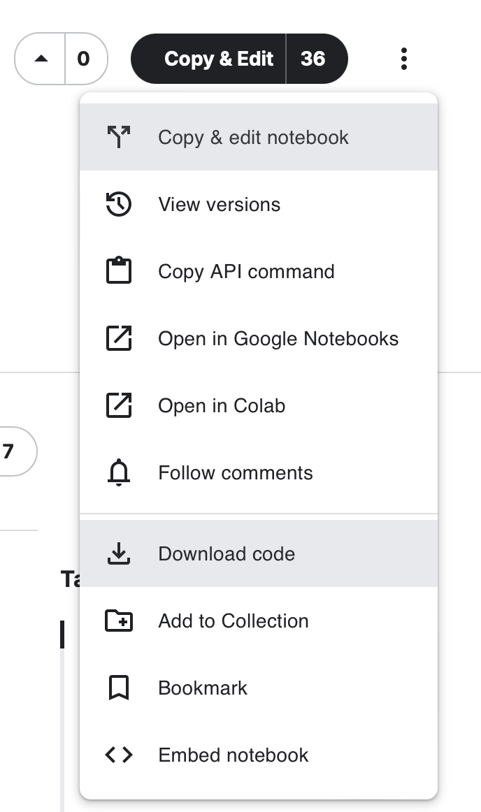
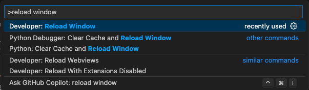

## MGL7320 - Ingénierie logicielle des systèmes d'IA
# 02 - Apprentissage Machine (ML)

## Prelude

- Quizz - [https://ahaslides.com/CU2S7](https://ahaslides.com/CU2S7)
- Questions / réponses concernant le cours de la semaine dernière

## Lectures du jour
- :bulb: [Apprentissage Machine (ML)](./02_machine_learning.pdf)

## (Various) Data Structures
<details>
<summary>À déplier</summary>

|  Storage | Model |  Similar to | Benefits
|---|---|---|---|
|  Relational Database | Relational | MySQL, Oracle DB, etc. | Complex structures, SQL (Structured Query Language)
|  Text File |  Unstructured |  Plain English, French, etc. | Natural Language
|  CSV Files |  Row-oriented |  Excel | Compact, Splittable
|  [Parquet](https://en.wikipedia.org/wiki/Apache_Parquet) |  Column-oriented |  [Cassandra](https://en.wikipedia.org/wiki/Apache_Cassandra) | Could be more efficient (R/W & Compression) than Row-oriented
|  [MongoDB](https://en.wikipedia.org/wiki/MongoDB) |  Semi-structured |  JSON, XML, YAML, [Avro](https://en.wikipedia.org/wiki/Apache_Avro) | Easy to read (self-describing), flexible

### Relational Database


- https://docs.microsoft.com/en-us/azure/architecture/data-guide/relational-data/

### Example of the same Data declined in various NoSQL Formats
(taken from [Column-oriented](https://en.wikipedia.org/wiki/Column-oriented_DBMS) Wiki Page)

| RowId	| EmpId	| Lastname	| Firstname	| Salary |
|---|---|---|---|---|
| 001	| 10	| Smith	| Joe	| 40000
| 002	| 12	| 	| Mary | 50000
| 003	| 11	| Johnson	| Cathy	| |
| 004	| 22	| Jones	| Bob	| 55000

#### Row-oriented
```cs
RowId:EmpId,Lastname,Firstname,Salary
001:10,Smith,Joe,40000;
002:12,,Mary,50000;
003:11,Johnson,Cathy;
004:22,Jones,Bob,55000;
```

#### Column-oriented
```cs
10:001,12:002,11:003,22:004;
Smith:001,Johnson:003,Jones:004;
Joe:001,Mary:002,Cathy:003,Bob:004;
40000:001,50000:002,55000:004;
```

#### Semi-structured
##### JSon
JSon est un sous-ensemble de la syntaxe JavaScript Object Notation
- les données sont stockées sous forme de paires nom/valeur
- les enregistrements sont séparés par des virgules
- les noms de champs et les chaînes de caractères sont entourés de guillemets doubles

``` json
{
  "employees": [
    {
      "EmpId": 10,
      "Lastname": "Smith",
      "Firstname": "Joe",
      "Salary": "40000"
    },
    {
      "EmpId": 12,
      "Firstname": "Mary",
      "Salary": "50000"
    },
    {
      "EmpId": 11,
      "Lastname": "Johnson",
      "Firstname": "Cathy"
    },
    {
      "EmpId": 22,
      "Lastname": "Jones",
      "Firstname": "Bob",
      "Salary": "55000"
    }
  ]
}
```

##### YAML
est un sur-ensemble de JSON
- les fichiers `.yml` [commencent par '---', marquant le début du document] (optionnel)
- les paires clé-valeur sont séparées par des deux-points
- les listes commencent par un tiret

``` yaml
---
employees:
- EmpId: 10
  Lastname: Smith
  Firstname: Joe
  Salary: 40000
- EmpId: 12
  Firstname: Mary
  Salary: 50000
- EmpId: 11
  Lastname: Johnson
  Firstname: Cathy
- EmpId: 22
  Lastname: Jones
  Firstname: Bob
  Salary: 55000
```

##### XML
Un format plus ancien (plus verbeux, plus difficile à lire) qui est principalement utilisé pour les échanges SOAP (abréviation de Simple Object Access Protocol), les fichiers de configuration hérités, ainsi que les applications Web (XML est similaire à HTML)

```xml
<?xml version="1.0" encoding="UTF-8"?>
<root>
   <employees>
      <element>
         <EmpId>10</EmpId>
         <Firstname>Joe</Firstname>
         <Lastname>Smith</Lastname>
         <Salary>40000</Salary>
      </element>
      <element>
         <EmpId>12</EmpId>
         <Firstname>Mary</Firstname>
         <Salary>50000</Salary>
      </element>
      <element>
         <EmpId>11</EmpId>
         <Firstname>Cathy</Firstname>
         <Lastname>Johnson</Lastname>
      </element>
      <element>
         <EmpId>22</EmpId>
         <Firstname>Bob</Firstname>
         <Lastname>Jones</Lastname>
         <Salary>55000</Salary>
      </element>
   </employees>
</root>
```

:bulb: Astuce, des outils en ligne sont disponibles pour convertir CSV en JSON, JSON en YAML, etc. :warning: Ne pas utiliser pour des données sensibles !
</details>

## Exercice pratique

- [ ] Récupérez le notebook [MGL7811_GermanCreditReport](https://www.kaggle.com/code/diegoeliascosta/mgl7811-germancreditreport)

{:width="50%"}

- [ ] Ainsi que les données, disponibles dans l'onglet "Input'

:bulb: J'utilise l'extension suivante pour aider à la visualisation du fichier CSV : [Rainbow CSV](https://marketplace.visualstudio.com/items?itemName=mechatroner.rainbow-csv)

- [ ] Installez le tout dans votre environnement de travail (VS Code)

- [ ] Configurez votre environnement et y exécuter le notebook Jupyter
  - [ ] [Installing conda](https://conda.io/projects/conda/en/latest/user-guide/install/index.html)
  - [ ] [Pip vs Conda](https://saturncloud.io/blog/pip-vs-conda-a-guide-to-managing-python-packages-for-data-scientists/)
  <br>
Sur mon ordinateur (Mac OS) :
```shell
conda install -c anaconda ipykernel
conda create -n mgl7320  python=3.11 ipykernel
conda activate mgl7320
brew install libomp   [ou équivalent pour Windows]
pip install numpy pandas seaborn matplotlib scikit-learn xgboost
```
:bulb: N'oubliez pas que Copilot est votre ami !
  - [ ] [Python Interactive window](https://code.visualstudio.com/docs/python/jupyter-support-py#)
  - [ ] [Set Up Jupyter Notebook in VSCode Using Conda Env](https://medium.com/@jasminewu_yi/set-up-jupyter-notebook-in-vscode-using-conda-env-69d50fc51d78)
  <br>
  :bulb: `Ctrl-Shift-P` (Windows) `Cmd-Shift-P` (Mac)
  

## Travail personnel pour la semaine prochaine
- [ ] Complétez l'exécution du notebook
  - [ ] Essayez d'en comprendre le contenu
  - [ ] La librairie [eli5](https://pypi.org/project/eli5/) n'étant plus maintenue depuis mai 2022, elle n'est plus compatible avec scikit-learn. Remplacez donc le code impacté (:bulb: Copilot est votre ami !)
