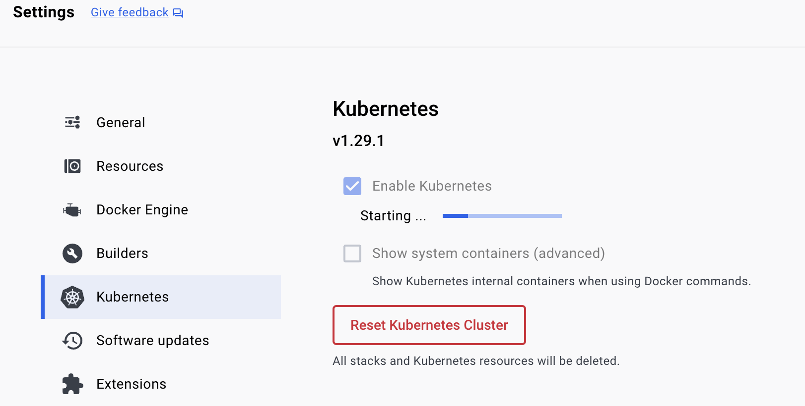

## MGL7320 - Ingénierie logicielle des systèmes d'IA
# 03 - Docker et autres outils

## Prelude

- Quizz - https://ahaslides.com/IZN44
- Questions / réponses concernant le cours de la semaine dernière

## Théorie
- :book: [Docker & Kubernetes - aka K8s](<inf8200_cours3 - docker.pdf>)

## Pratique

### Lignes de commande

Dans les exercices qui viennent (ainsi que dans votre future vie professionnelle !), vous n'aurez pas le choix que d'utiliser des lignes de commande. Voici notamment un tutoriel pour vous y former : [Introduction to the command-line interface](https://tutorial.djangogirls.org/en/intro_to_command_line/).

### Docker

- Références utiles
    * https://docs.docker.com/engine/reference/commandline/history/
    * https://docs.docker.com/engine/reference/commandline/exec/
    * https://www.cyberciti.biz/faq/bash-infinite-loop/
    * https://www.rapidtables.com/code/linux/ls.html
    * https://docs.docker.com/build/building/best-practices/
 
<br>
- [ ] Explorez le tutoriel [Tutoriel Docker 101](https://www.docker.com/101-tutorial/)
    - Exécuter ```docker run -dp 80:80 docker/getting-started```
    - Ouvrir [http://localhost](http://localhost) dans votre navigateur et suivre les instructions.
<br>
:bulb: En cas de soucis sur un Mac Apple Silicon (M1, M2, etc.), vous pouvez aller voir du côté de [DOCKER_DEFAULT_PLATFORM](https://forums.docker.com/t/docker-default-platform-should-be-more-obvious-to-apple-silicon-users-everyone/120805/2) forum.


:warning: Ne pas oublier en fin de session de "nettoyer" & de quitter Docker !
- [How to Do a Clean Restart of a Docker Instance](https://docs.tibco.com/pub/mash-local/4.3.0/doc/html/docker/GUID-BD850566-5B79-4915-987E-430FC38DAAE4.html)
- Autre option : utiliser l'interface graphique

- [ ] Jetez un oeil sur le tutoriel [Getting started with Swarm mode](https://docs.docker.com/engine/swarm/swarm-tutorial/). :warning: Pour compléter ce tutorial, il vous faut disposer de plusieurs machines (uniquement Linux ?).

- [ ] Explorez le [Tutoriel Kubernetes](https://kubernetes.io/docs/tutorials/kubernetes-basics/deploy-app/deploy-intro/) (alternative : [Mini tutoriel Kubernetes](./mini_tutoriel_k8s.md))

    Un _cluster_ K8s est fourni par Docker Desktop (en version single-node). Inutile donc d'installer ici _Minikube_. Par contre, il est indispensable d'[installer et configurer kubectl](https://docs.docker.com/desktop/kubernetes/).

    :warning: Ne pas oublier en fin de session de "nettoyer" & de quitter K8s !
    - [kubernetes cleanup of pods,service,deployment etc](https://stackoverflow.com/questions/57014430/kubernetes-cleanup-of-pods-service-deployment-etc)
    - Vous pouvez également appliquer un "_reset_" complet :


- [ ] Pour ceux qui ne sont pas familier avec Github (& Github Classroom) : [The Basics of GitHub](https://classroom.github.com/a/rxrnLylo)

## Travail personnel pour les prochaines semaines

- [ ] Il est recommandé de compléter les tutoriels, notamment si ce sont là des technologies nouvelles pour vous.

## Projet personnel

Voir sa [description](../projet_personnel.md). Dû pour le 15 octobre.


### Copyright (c)Laurent Magnin / UQÀM 2023-2024