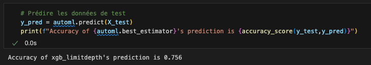

## MGL7320 - Ingénierie logicielle des systèmes d'IA
# 06 - Sélection des modèles

> ["All models are wrong, but some are useful"](https://en.wikipedia.org/wiki/All_models_are_wrong) (citation de George Box)

## Prelude

- Quizz - https://ahaslides.com/CG4NH

## Travail personnel attendu
- [ ] Vous regrouper en équipes de 4 étudiants en vue du projet commun
- [ ] [Github Classroom - Projet individuel](https://classroom.github.com/a/hZT7Ifs6)
- [ ] [GitHub Classroom - Projet en équipe](https://classroom.github.com/a/3yOWEyQK)

## Lectures du jour
- :bulb: [Sélection des modèles](./06_model_selection.pdf)

## Pratique - AutoML

- :tool: Utilisez une librairie d'AutoML (FLAML suggérée) pour évaluer en parallèle plusieurs modèles au sein du notebook [mgl7811-germancreditreport.ipynb](../02_machine_learning/solution/mgl7811-germancreditreport.ipynb), et ainsi choisir le plus performant (lui-même optimisé au travers de ses hyper-paramètres).

- Quelle amélioration en terme de précision obtenez-vous ?

:bulb: Pour aller plus loin, pourquoi ne pas combiner plusieurs modèles ensemble ?
-> [Stacked Ensembles](https://docs.h2o.ai/h2o/latest-stable/h2o-docs/data-science/stacked-ensembles.html), autrement appelé "_Super Learner_".

## Travail personnel pour la semaine prochaine

- [ ] Travailler _en groupe_ au spécifications d'évolution du projet ML

## Prochaine séance

- "Infrastructure(s) et Plateformes"

### Copyright (c)Laurent Magnin / UQÀM 2023-2024
