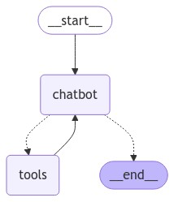
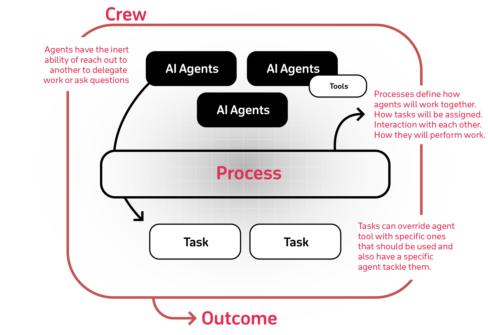

## MGL7320 - Ingénierie logicielle des systèmes d'IA
# 08 - Systèmes experts, Agents IA & Systèmes multiagents

## Prelude

- Quizz - https://ahaslides.com/

- Est-ce que toutes les [MGL7320 - équipes](https://docs.google.com/spreadsheets/d/1svBmf4keRuKFzRf8pBrOfwrKeTQkWT3_606SjKuYx6s/edit?gid=0#gid=0) sont bien constituées ?

## L'IA, une histoire mouvementée

[Intelligence artificielle : définition, histoire et application](https://www.justai.co/articles-de-blog/intelligence-artificielle)

### Systèmes experts

- :book: [Expert Systems](./08_expert_systems.pdf)

### Systèmes multiagents

#### Théorie

- :book: [From LLMs to Multi-Agents Systems - Agents & GenAI](./08_genai_agents.pdf)

#### Pratique

Le but de cet exercice est de créez un Chatbot à base d'agents et d'outils.

Voici LA question auquel le chatbot devra répondre, en faisant appel à des informations disponibles en ligne : _"What's the best restaurant in Montreal?"_

- [ ] La première implémentation doit se faire à partir du framework [LangGraph](https://www.langchain.com/langgraph)

    - Voir le tutoriel [LangGraph Quick Start - Chatbot](https://langchain-ai.github.io/langgraph/tutorials/introduction/)

 :bulb: Vous pouvez remplacer ChatAnthropic par Chat [Ollama](https://ollama.com) (fonctionne en utilisant le modèle `llama3.2:3b`)

:bulb: Vous aurez besoin d'un jeton (_token_) [Tavily](https://tavily.com), lequel est gratuit pour un usage modéré.

:warning: Ne **jamais** sauvegarder vos mots de passe directement dans le code. Pour les conserver en local sans avoir à les partager, vous pouvez utiliser des outils tels que [Dotenv](https://pypi.org/project/python-dotenv/) (:bomb: ajoutez les fichiers `.env` dans la liste `.gitignore` pour éviter qu'ils se retrouvent disponibles sur Github !).

- [ ] Construire un guide culinaire interactif en faisant appel à [CrewAI](https://docs.crewai.com/introduction)

## Travail personnel pour les prochaines semaines

- [ ] Visualisez 
<iframe width="560" height="315" src="https://www.youtube.com/embed/sal78ACtGTc?si=PUvqI97z-gYYnbwF" title="YouTube video player" frameborder="0" allow="accelerometer; autoplay; clipboard-write; encrypted-media; gyroscope; picture-in-picture; web-share" referrerpolicy="strict-origin-when-cross-origin" allowfullscreen></iframe>

- [ ] Version écrite par le même auteur : _[Agentic Design Patterns](https://www.deeplearning.ai/the-batch/how-agents-can-improve-llm-performance/)_

- [ ] Complétez les exercices du jour.

- [ ] Explorez les [tutoriels LangGraph](https://langchain-ai.github.io/langgraph/tutorials/)

- [ ] Pour aller plus loin : [LLM Powered Autonomous Agents](https://lilianweng.github.io/posts/2023-06-23-agent/)

### Copyright (c)Laurent Magnin / UQÀM 2023-2024

