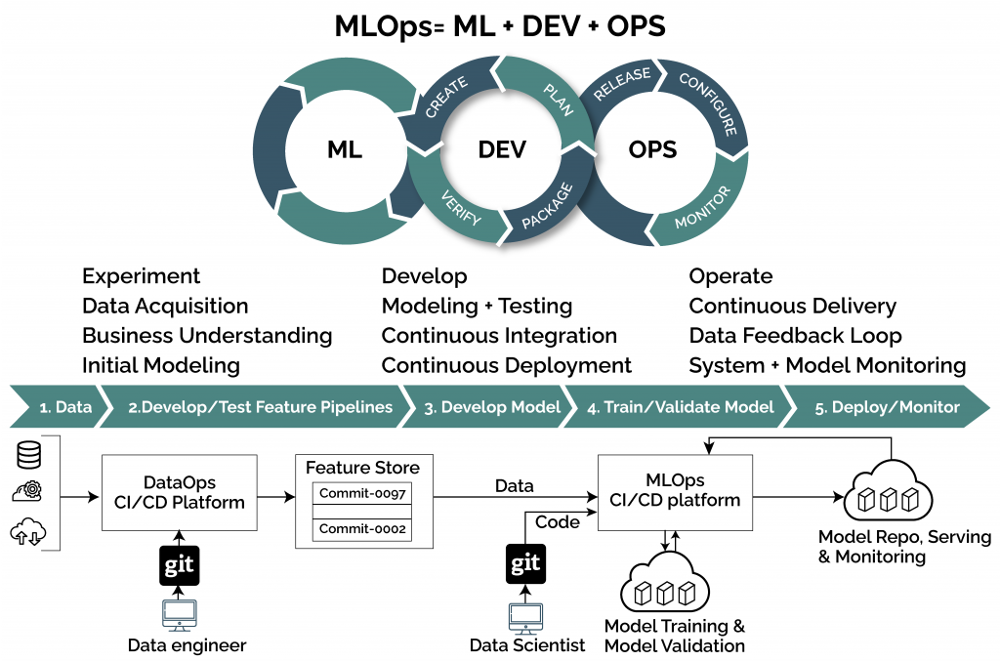
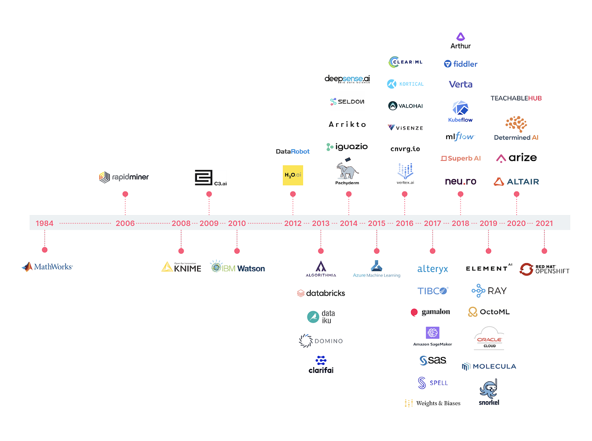
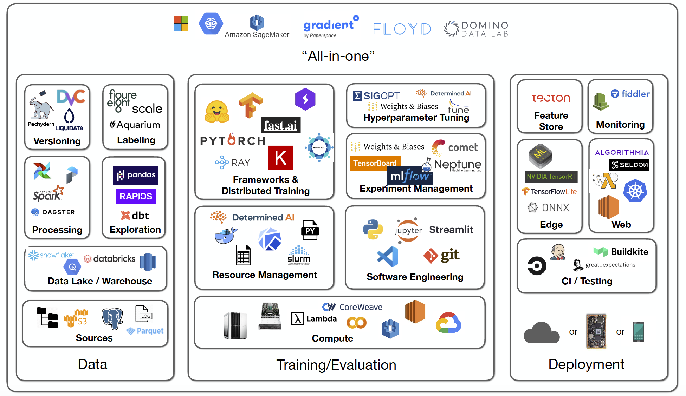
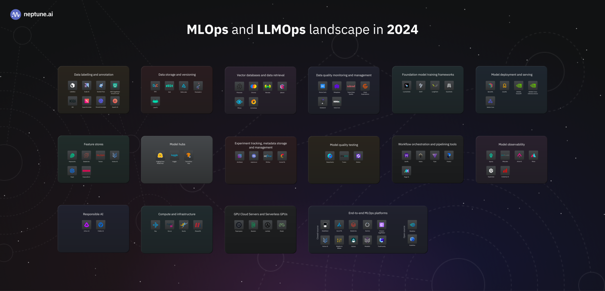

## MGL7320 - Ingénierie logicielle des systèmes d'IA
# 07 - Infrastructure(s), Outils et Plateformes

## Prelude

- Quizz - https://ahaslides.com/

## Présentations du jour

:bulb: _ML & GenAI_ : Quel(s) environnement(s), plateforme(s) et outil(s) utiliser ?

=> [The Fundamentals Of MLOps](https://www.radiant.digital/the-fundamentals-of-mlops-the-enabler-of-quality-outcomes-in-production-environments/)

=> [How do you evaluate MLOps platforms?](https://medium.com/mlops-community/how-to-evaluate-mlops-platforms-c98cf7874cca)

=> [MLOps Infrastructure & Tooling](https://fullstackdeeplearning.com/spring2021/lecture-6/)

=> [MLOps Landscape in 2024: Top Tools and Platforms](https://neptune.ai/blog/mlops-tools-platforms-landscape)

### Quelle(s) infrastructure(s) ?

- _Personal Computer_
- _Cloud_
  - _Serverless_ ?
- _On-premise_ (serveurs sur site)
  - Architecture hybride ?

> Avantages et inconvénients de ces environnements ?

### Préparation des données
- [Snorkel](https://snorkel.ai)
  - [Revolutionizing Machine Learning with Weak Supervision & Snorkel](https://ai.plainenglish.io/revolutionizing-machine-learning-with-weak-supervision-snorkel-8c319865d6bf)
  - :tv: [Introduction to Snorkel Flow](https://www.youtube.com/watch?v=hoszPGTW8bY)
- [What Is a Feature Store?](https://www.tecton.ai/blog/what-is-a-feature-store/)
  - :tv: [What is a Feature Store for Machine Learning?](https://www.youtube.com/watch?v=DESBDukN9gw)

### Entraînement des modèles
- [Jupyter Notebook](https://jupyter.org)
- [H2O Stacked Ensembles](https://docs.h2o.ai/h2o/latest-stable/h2o-docs/data-science/stacked-ensembles.html)
  - :tv: [How the H2O AutoML platform works](https://www.youtube.com/watch?v=tpvpiGP5rcc)

### Déploiement des modèles
- [What is MLflow?](https://mlflow.org/docs/latest/what-is-mlflow.html)
  - :tv: [What is MLflow?](https://www.youtube.com/watch?v=8SfZ1ElgpdU)
- [NVIDIA NIM for Developers](https://developer.nvidia.com/nim)
  - :tv: [How to self-host and hyperscale AI with Nvidia NIM](https://youtu.be/ZgGss27IfwA?si=aa8QCxiS-gcHTvAi)

### Sauvegarde et manipulation des données
- :tv: [Database vs Data Warehouse vs Data Lake | What is the Difference?](https://www.youtube.com/watch?v=-bSkREem8dM)
- :tv: [Intro to Data Lakehouse](https://www.youtube.com/watch?v=myLiFw9AUKY)

### Environnements intégrés
- [Dataiku](https://www.dataiku.com)
  - :tv: [Dataiku - End to End Demo 2024](https://youtu.be/IovPzrLHw8A?si=hDEObpUyci6_VgNK)
- [Databricks](https://www.databricks.com)
  - :tv: [Lakehouse ML on Databricks Demo](https://www.youtube.com/watch?v=1TPu-uOLglI)

## Travail personnel pour la semaine prochaine

- [ ] :warning: Compléter la constitution des [équipes](https://docs.google.com/spreadsheets/d/1svBmf4keRuKFzRf8pBrOfwrKeTQkWT3_606SjKuYx6s/edit?usp=sharing) !
- [ ] Préparer la présentation (15 minutes + questions) du plan du projet en équipe

## Prochaine séance

- Présentations par équipes
- Travaux en équipe pour raffiner les plans de développement

### Copyright (c)Laurent Magnin / UQÀM 2023-2024
