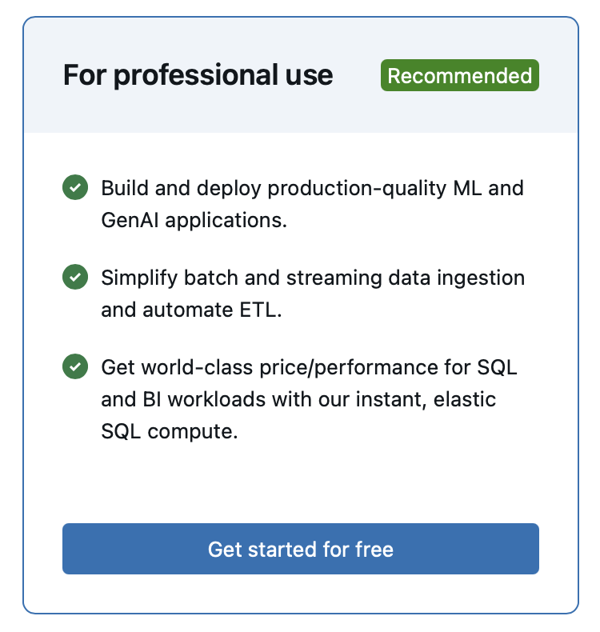
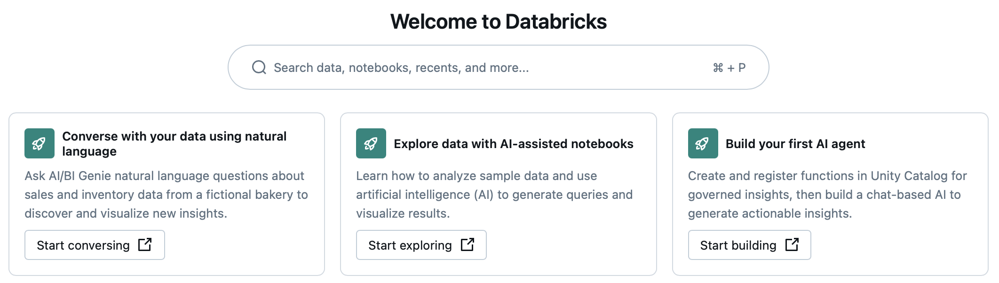

## MGL7320 - Ingénierie logicielle des systèmes d'IA

# 11 - Atelier Databricks

## Accès à la plateforme



Obtenez un accès à [Databricks Express](https://login.databricks.com/?dbx_source=direct&tuuid=bcfa64fd-c613-44db-ab17-829f9967f9ac&intent=SIGN_UP&rl_aid=c55e5117-f27c-4d7e-976c-bf2619d6b998) (gratuit, sans carte de crédit)

Choisir la version pour usage professionnel, puis "Use express setup", enfin utilisez le mode d’authentification par courriel @uqam.

## Tutoriels



Complétez les tutoriels présents sur la première page :

:warning: Ouvrez ces tutoriels dans de nouveaux onglets... au risque d'en perdre l'accès.

- _Converse with your data using natural language_
    - :question: Pourquoi un "Warehouse" est nécessaire ? Est-ce que vous pouvez le retrouver ?
    - :question: D'où viennent les données ?

- _Explore data with AI-assisted notebooks_
    - Poursuivez avec _Continue exploring Notebooks!_

- _build your first AI agent_
    - :question: quels sont les LLMs disponibles ?
    - :builb: Pour aller plus loin : _Excited for more?_ / _RAG-based chatbot_ (:warning: _This demo might not fully work on Serverless and Databricks Test Drive!_)

:build: Vous devriez pouvoir avoir accès à votre usage de la plateforme à travers le tableau intitulé _Workspace Usage Dashboard_ [Non fonctionnel au moment où j'écris ces lignes].

## Exercices pratique (reprise des cours précédents)

### Apprentissage automatique

En vous inspirant du tutoriel [Use scikit-learn with MLflow integration on Databricks](https://docs.databricks.com/en/mlflow/end-to-end-example.html) (:warning: lequel n'est pas 100% fonctionnel dans un environnement _serverless_), intégrez dans l'environnement Databricks le notebook [mgl7811-germancreditreport.ipynb](../02_machine_learning/solution/mgl7811-germancreditreport.ipynb).

:bulb:
```python
CATALOG_NAME = "workspace"
SCHEMA_NAME = "default"
```

:question: Où se trouve les expérimentations gérées par MLFlow ?

#### Transférer dans l'environnement Databricks les exercices des précédents cours

- [Intelligence Artificielle Générative](../07_gen_ai)
- [Systèmes multiagents](../08_agents)

## Rappel : Évaluation du cours

Il est encore temps (2024-11-19 au 2024-12-02) de compléter l'évaluation du cours.

## Prochaines séances

- [Examen](../examen.md)

- Pour les projets en équipe, la durée allouée pour les présentations est de 30 minutes + Q/A


### Copyright (c)Laurent Magnin / UQÀM 2023-2024


