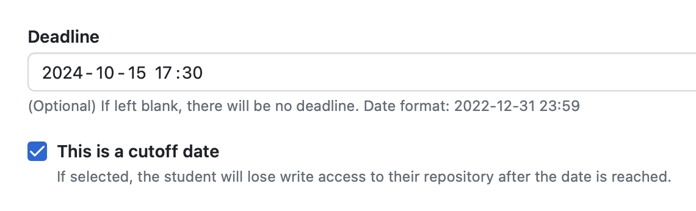

# Projet personnel

## Description

Le but de votre projet [personnel](https://r18.uqam.ca/reglement-18.html) (seul Copilot est votre ami !) est de pouvoir faire tourner le notebook [MGL7811_GermanCreditReport](https://www.kaggle.com/code/diegoeliascosta/mgl7811-germancreditreport) au sein d'un environnement ayant les caractéristiques suivantes :
- L'ensemble des composants (Jupyter, etc.) devront s'exécuter **au sein de conteneurs Docker** ( :bulb: À vous de choisir la "bonne" architecture, en fonction notamment des capacités de votre ordinateur) ;
- le _dataset_ devra provenir d'une base de données NoSQL (qu'il vous faudra choisir) ;
- Une documentation (sous forme README.md à la racine du projet) est demandée. Celle-ci doit notamment expliquer un minimum l'architecture choisie (et le pourquoi de ces choix) ; pour le reste, vous pouvez vous inspirer de la documentation typique de projets _Open Source_ ;
- Ne conservez dans la branche _main_ que les éléments devant être présentés (:bub: vous pouvez travailler dans une branche _dev_, et faire des _merges_ réguliers dans la branche _main_). :warning: Des éléments non pertinents (ancienne version de code, etc.) restant dans la branche principale pourraient vous coûter des points !
- Il est nécessaire que quelqu'un ayant accès à votre dépôt GitHub puisse facilement reproduire et exécuter votre application.

## Remise

Ce travail est dû pour le **15 octobre 2024** :

- Pour 10 % de la note totale, l'ensemble des éléments remis (code, documentation) devront être déposés au sein du dépôt Github Classroom suivant : https://classroom.github.com/a/CNclaupz, avant 17 h 30 ! (:bulb: Faites de remises régulières pour ne pas risquer de tout perdre). 

- Pour 10 % de la note totale, une présentation et démonstration devra être faite lors du cours régulier (a priori 5 minutes chacun - durée qui pourra évoluer en fonction du nombre de projets qui seront finalement présentés -). :bulb: N'oubliez pas de montrer vos composants Docker en train de s'exécuter !

    Pour vous éviter de perdre du temps à vous installer au pupitre, un partage par _Teams_ est à envisager.
